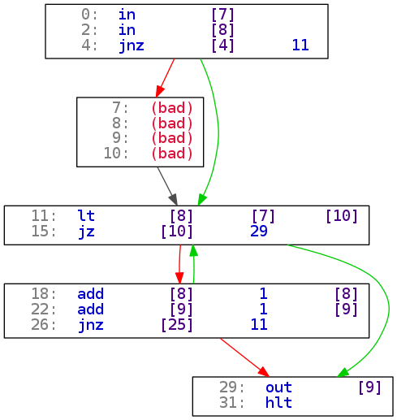

Intcode!
========

Some tools to work with Intcode programs.

Intcode VM & disassembler
-------------------------

The program `intcode.py` is a python script capable of disassembling and running
Intcode programs. It takes input from standard input and outputs to standard
output. Any disassembled code is printed to standard error.

Disassemble an Intcode program:

	./intcode.py dis prog.txt

Run an Intcode program:

	./intcode.py run prog.txt

Run an Intcode program in debug mode:

	./intcode.py debug prog.txt

Intcode CFG generator
---------------------

Simple python script which parses the CFG of an Intcode program and generates a
`.dot` file describing it. The file can then be processed with any tool which
deals with `.dot` files, like for example the `dot` program.

Generate an image of the CFG of an Intcode program:

    ./intcode_to_dot.py intcode.txt cfg.dot
    dot -Tpng cfg.dot > cfg.png

Here's an example of the result (more in the [examples](examples) folder):

