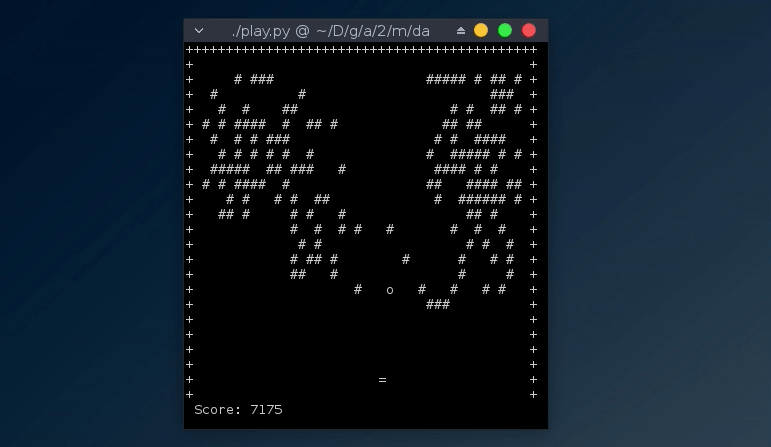

Intcode arcade!
===============

What a funny puzzle today. The Intcode program given as input was a fully
functioning brick breaker arcade game! This folder contains the disassembled
intcode program, its CFG and a python script that emulates and plays the game
drawing it in ASCII art on the terminal using ncurses.

To run the game simply get a valid 2019 day 13 input and then run `play.py`:

	./play.py valid_day13_input.txt
