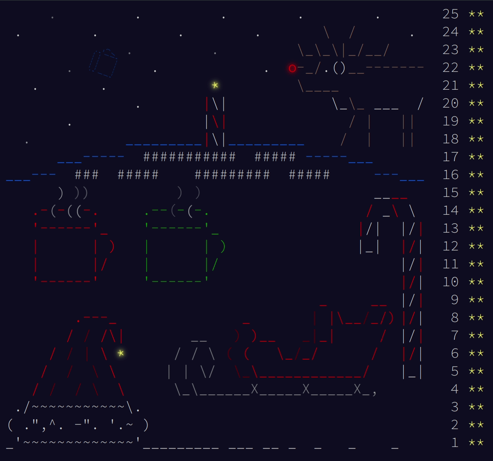
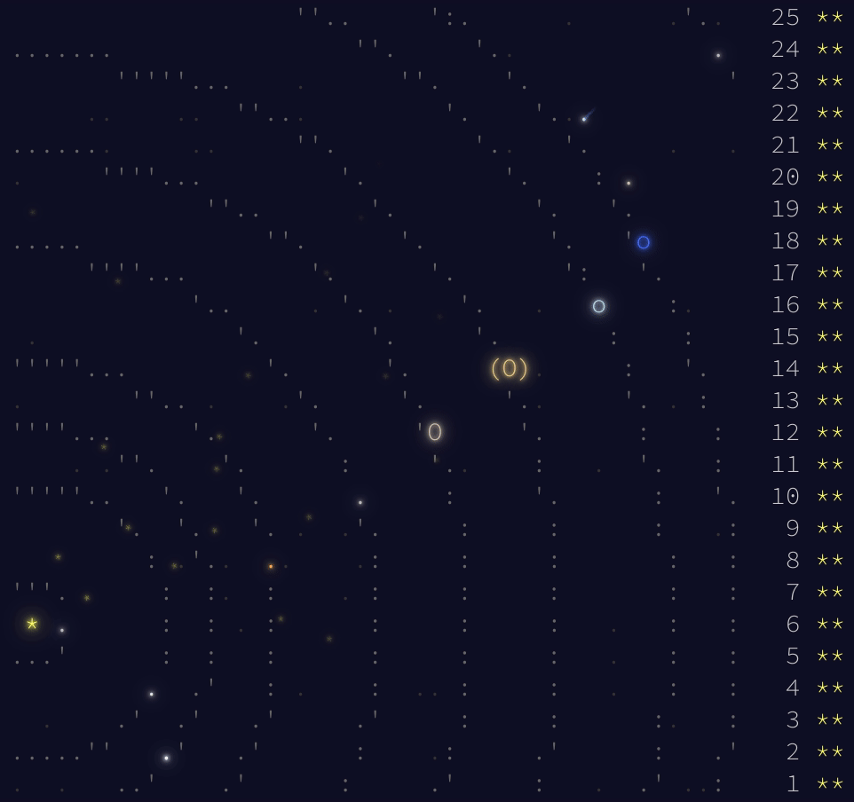

Advent of Code
==============

Personal repository of [Advent of Code](#about-advent-of-code) solutions.

### Quick links

- **Advent of Code 2020:  [walkthrough][2020-wal],
  [clean][2020-sol] / [original][2020-ori] solutions**
- Advent of Code 2019: [walkthrough][2019-wal],
  [clean][2019-sol] / [original][2019-ori] solutions,
  [full leaderboard][2019-lea]
- Advent of Code 2018: [clean][2018-sol] / [original][2018-ori] solutions,
  [full leaderboard][2018-lea]

About Advent of Code
--------------------

[Advent of Code][aoc-about] is an Advent calendar of small programming puzzles
for a variety of skill sets and skill levels that can be solved in any
programming language you like. One programming puzzle a day is released from 1st
to 25th December, divided in two parts (the second of which is unlocked after
solving the first). Advent of Code is created by [Eric Wastl][aoc-eric], and is
100% free. If you like Advent Of Code and want to support its creator, you can
donate to him [here][aoc-support]. If you want to hang out with other fellow
coders, discuss about puzzles and solutions, or just have a look around, you can
join the official subreddit: [r/adventofcode][aoc-reddit], or the unofficial IRC
channel: `##adventofcode` on `irc.freenode.com`, where you can also find me at
the right time of the year.

About this repo
---------------

I discovered Advent of Code in 2017, and played my first edition in 2018. In
this repository you can find my solutions and walkthroughs for the puzzles as
well as other miscellaneus stuff like visualizations and other scripts.

In each year's folder you will find:

- `README.md`: an in depth walkthrough of my (clean) solutions for the puzzle,
  day by day, with references to used algorithms and data structures and
  sometimes also comments/reflections.
- `solutions/`: clean solutions for the puzzles. I usually rewrite, polish and
   optimize my original solutions whenever I have time after my first solve,
   along with a detailed walkthrough.
- `original_solutions/`: my *almost unedited* original solutions for the
  puzzles, written as fast as I could while trying to solve puzzles for the
  first time. These solutions may use helpers I defined in my own `utils`
  module, as well as other external modules to make things easier. Do not expect
  the code in here to be sane/readable/fast**[1]**.
- `inputs/`: my puzzle inputs.
- `lib/`: small library of utilities written for this specific year. There are
  recurring concepts and problems each year. If needed, this folder will hold
  common code used by multiple solutions.
- `misc/`: anything else interesting. This includes image/video visualizations
  of puzzles, additional interesting scripts, and so on.

   - `full_leaderboard.md`: a complete leaderboard of all participants of
     advent of code, including those who do not make it to the top 100, built by
     by scraping each day's leaderboard.
   - `calendar.gif`: a GIF of the animated complete calendar for the year.
     That is, if I managed to finish all puzzles.

**[1]** I chose to upload "original" versions of solutions for two reasons:
they are a good and fun way to see how I code, and they can be uploaded as soon
as the leaderboard for the day is complete, as I often don't have time to
rewrite them more cleanly right away.

If you enjoy what I'm doing and would like to say "thanks", you can
[buy me a drink here][paypal-donate-btn].

Complete calendars
------------------

2018                                      | 2019
------------------------------------------|------------------------------------------
 | 

[2020-wal]: 2020/README.md
[2020-sol]: 2020/solutions
[2020-ori]: 2020/original_solutions
[2020-lea]: 2020/misc/full_leaderboard.md
[2020-cal]: 2020/misc/calendar.gif

[2019-wal]: 2019/README.md
[2019-sol]: 2019/solutions
[2019-ori]: 2019/original_solutions
[2019-lea]: 2019/misc/full_leaderboard.md
[2019-cal]: 2019/misc/calendar.gif

[2018-wal]: 2018/README.md
[2018-sol]: 2018/solutions
[2018-ori]: 2018/original_solutions
[2018-lea]: 2018/misc/full_leaderboard.md
[2018-cal]: 2018/misc/calendar.gif

[aoc-about]:   https://adventofcode.com/2019/about
[aoc-eric]:    https://twitter.com/ericwastl
[aoc-support]: https://adventofcode.com/2019/support
[aoc-reddit]:  https://www.reddit.com/r/adventofcode/

[paypal-donate-btn]: https://www.paypal.com/donate/?hosted_button_id=FFGV44B3SLHBL&locale.x=en_IT